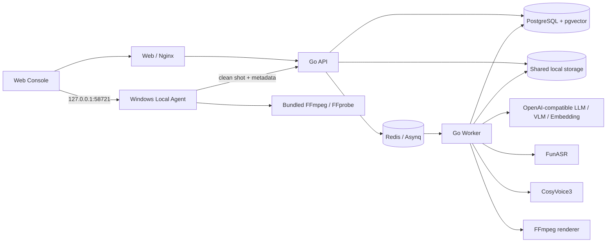

# ACRUNU Fast Cut

[](./LICENSE)
[](./go.mod)
[](./apps/web/package.json)

ACRUNU Fast Cut（艾锐伦快剪辑系统）是一套面向信息流广告生产的素材库驱动型短视频批量剪辑系统。它将人工清洗后的可复用镜头、VLM/ASR 素材理解、向量检索、LLM 文案与镜头编排、TTS 配音、字幕、背景音乐和 FFmpeg 渲染组织成一条可复核、可重试的生产流程。

本项目不是通用非线性编辑器，也不尝试将未经整理的长视频直接交给模型完成端到端剪辑。系统的核心前提是：先把原始视频清洗为动作明确、边界完整的短镜头，再让模型在受控候选集中完成检索与编排。

## 核心能力

### 产品与卖点

- 管理产品、产品描述、参考图和卖点。
- 统计产品关联的素材与卖点覆盖情况。
- 产品、素材、任务和成片位于同一个共享工作空间，操作记录保留创建者信息。

### Windows 素材预处理

- 浏览器进入预处理页时自动检查 Local Agent，未安装或版本过旧时提供同源安装包下载。
- 批量导入客户机上的原始视频，在本地完成预览、入点/出点设置、裁切、缩略图和抽帧。
- 区分 `visual_only`（纯画面）与 `talking_head`（口播）素材，并为每条素材独立设置是否保留原声。
- 支持口播转写、VLM 标注、批量选择、框选、批量 VLM、批量提交和本地工作区删除。
- 正式提交前校验 VLM 状态；未完成、处理中、失败或分析已过期的素材不能入库。
- 只上传清洗后的 clean shot 和确认后的元数据，原始文件保留在客户机。

### 素材理解与检索

- 使用 VLM 分析画面、产品、场景、动作、人物、景别、运镜、光线和质量信息。
- 使用 ASR 将口播素材拆分为可检索的语音片段。
- 保存结构化元数据、开放语义描述和 pgvector 向量，支持结构化筛选与自然语言搜索。
- 在“分析与维护”中人工复核描述、动作、标签和卖点关联，并重新生成向量。
- 支持单条或批量重新 VLM；服务端从正式 clean shot 重新分析，完成后自动更新索引。
- 支持归档、批量归档和恢复。归档素材不会参与检索和自动编排。
- 提供基于 Three.js 的语义空间，可在 2D/3D 点云中查看素材分布、查询结果和最近邻，并直接打开素材详情。

### 文案与任务工作台

- 根据产品和用户选择的全部卖点异步生成多个信息流口播版本。
- 可设置目标时长、生成温度、画幅、旁白音色、字幕样式和背景音乐。
- 支持试听音色、编辑文案、逐条确认和全部确认；只有确认后的文案会提交任务。
- 支持通过空白行分隔批量粘贴文案，也支持 CSV/XLSX 导入、模板下载和列映射；工作台最多容纳 200 条文案。
- 文案生成任务保存在服务端，离开工作台后返回仍可恢复生成进度和结果。
- 每条确认文案独立进入生成队列，单条失败不会抹掉同批其他任务。

### 自动编排与渲染

- 以真实 TTS 旁白时间线为主轴生成字幕和视觉节拍，而不是按文案字符数估算成片时间。
- LLM 只在向量检索返回的合法候选集中选择素材；服务端负责时间线、素材范围和单条成片内素材不重复等硬约束。
- 支持纯画面和口播镜头混排、原声音轨、背景音乐增益、字幕样式和横竖屏输出。
- FunASR 对合成旁白进行对齐校验，并依据逐字时间戳裁掉正文末尾偶发的额外语音。
- Go worker 使用 FFmpeg 确定性渲染最终 MP4；当前生产编码为 CPU `libx264`，目标码率 16 Mbps、最大码率 24 Mbps。

### 成品复核

- 成品库按日期分组，显示生成批次标记，并支持筛选、批量选择、右键操作、重试、重新生成、删除和批量下载。
- 详情页以视频为主，可通过滚轮或上一条/下一条切换，并在返回列表时恢复原浏览位置。
- 查看脚本文案、任务阶段、错误信息、镜头编排和素材来源。
- 对单个镜头重新搜索候选并替换，保留其余镜头后重新渲染。
- 独立重新生成旁白，试听后再应用；应用时保留已有素材和镜头顺序，只重算旁白、字幕与镜头时间并重新渲染。失败不会覆盖原成片。

### 系统管理

- `admin` 可管理用户、OpenAI Compatible 模型供应商、默认 LLM/VLM/Embedding 模型、旁白音色、字幕样式和运行控制。
- 运行控制覆盖 VLM、ASR、TTS、FFmpeg 渲染并发，单用户排队/运行任务上限，以及 VLM 超时与重试参数。
- 普通用户可使用共享的产品、素材、音乐、工作台和成品库，但不能访问系统设置和用户管理。

## 处理流程

1. 在“产品”中创建产品，填写事实信息、上传参考图并维护卖点。
2. 在“预处理”中安装或唤起 Windows Local Agent，批量导入原始视频。
3. 为每条素材设置有效画面范围、素材类型和原声策略，完成 VLM 或口播转写。
4. 批量正式提交 clean shot。服务端创建素材、保存分析结果并生成向量。
5. 在“素材”中复核画面与动作语义，修正错误描述、关联卖点或重新 VLM。
6. 在“设置”中准备模型供应商、音色和字幕样式，在“音乐库”中准备可用 BGM。
7. 在“工作台”生成或导入文案，设置时长、温度、画幅、音色、字幕和 BGM，然后确认文案。
8. 提交任务后，worker 依次完成配音、ASR 对齐、视觉规划、向量召回、受约束镜头选择和 FFmpeg 渲染。
9. 在“成品库”查看结果，按需重试任务、替换镜头、重新生成旁白、下载或删除成片。

## 系统架构



### 组件职责

| 组件 | 目录 | 职责 |
| --- | --- | --- |
| Web Console | `apps/web` | React 管理界面、素材预处理交互、工作台和成品复核 |
| API | `apps/api` | 鉴权、业务 API、上传、配置、任务创建和状态查询 |
| Worker | `apps/worker` | 消费 Asynq 任务，执行分析、向量、文案、配音、编排和渲染 |
| Local Agent | `apps/local-agent` | Windows 托盘程序，访问本地原始文件并调用本地 FFmpeg |
| Domain services | `internal/services` | 产品、素材、模型配置、任务、配音、规划和渲染业务逻辑 |
| Model gateway | `internal/modelgateway` | OpenAI Compatible 模型请求、响应解析、超时和重试 |
| Media layer | `internal/ffmpeg` | 探测、裁切、时间线装配、字幕、混音和最终编码 |
| Data layer | `migrations`, `sql` | goose 数据库迁移、sqlc 查询和 pgvector 数据结构 |
| Deployment | `deploy`, `scripts` | Docker 镜像、Compose 服务、监控、安装包和发布脚本 |

### 数据边界

- 原始素材和 Local Agent 工作区位于用户电脑，不作为服务端素材直接参与编排。
- 服务端从正式提交的 clean shot 开始管理素材、抽帧、分析、向量、配音和成片。
- API 与 worker 必须挂载同一个 `storage/`，否则数据库中的存储键无法在两个进程间正确解析。
- 当前文件存储实现为本地共享目录；`STORAGE_BACKEND` 已保留配置入口，但仓库尚未提供可直接使用的 S3/MinIO 实现。
- PostgreSQL 保存业务状态和向量，Redis 负责异步任务；两者都不是可丢弃缓存。

## 技术栈

- Go 1.25、Gin、pgx/sqlc、goose、Asynq、slog
- React 18、TypeScript、Vite 6、Ant Design、Three.js、Playwright
- PostgreSQL 16 + pgvector、Redis 7
- FFmpeg/FFprobe
- FunASR、CosyVoice3
- OpenAI Compatible LLM、VLM 和 Embedding 服务
- Docker Compose、Nginx、Inno Setup 6
- 可选 Prometheus、Grafana、node-exporter、cAdvisor

Remotion 容器目前只提供基础设施和 smoke render，不参与生产成片链路。生产成片由 Go worker 内的 FFmpeg renderer 完成。

## 仓库结构

```text
apps/
  api/                 API 进程入口
  worker/              异步 worker 入口
  web/                 React Web Console
  local-agent/         Windows Local Agent
internal/
  ffmpeg/              媒体探测、裁切与渲染
  httpserver/          Gin 路由、中间件和处理器
  localagent/          本地工作区与预处理逻辑
  modelgateway/        模型协议与供应商适配
  queue/               Asynq 任务定义与客户端
  repository/          数据访问实现
  services/            应用服务和生成流水线
migrations/            goose SQL 迁移
sql/                    sqlc 配置与查询
deploy/                 Dockerfile、Nginx、ASR/TTS、监控等
scripts/                构建、迁移检查、发布和远程部署脚本
docs/                   系统设计、架构和用户教程
storage/                本地媒体与生成产物，内容不提交 Git
```

## 运行要求

### 服务端

- Linux x86-64
- Docker Engine 与 Docker Compose v2
- NVIDIA GPU、匹配的驱动和 NVIDIA Container Toolkit，用于仓库默认的 FunASR/CosyVoice Compose 服务
- 足够的磁盘空间保存 clean shot、抽帧、参考音频、配音、临时文件和最终成片
- 可访问所配置模型供应商和模型下载源的网络

API、Web、数据库和 Redis 本身不要求 GPU；使用默认 ASR/TTS 容器完成完整生成流程时需要 GPU。当前最终视频编码使用 CPU，应根据 CPU 核心数和磁盘吞吐设置渲染并发。

### 开发机

- Go 1.25
- Node.js 22（容器构建默认版本）与 npm
- FFmpeg/FFprobe
- Git
- Windows Local Agent 安装包构建还需要 Inno Setup 6

## 快速启动

### 1. 准备环境变量

```powershell
Copy-Item .env.example .env
```

`.env` 会被 Docker Compose 自动读取。Go 二进制不会自动加载 `.env`；直接使用 `go run` 时，需要在当前终端或 IDE 的运行配置中显式设置环境变量。

至少应修改数据库密码、Grafana 密码、绑定地址和部署环境。不要将 `.env`、模型 API Key 或服务器信息提交到 Git。

修改 `POSTGRES_USER`、`POSTGRES_PASSWORD` 或 `POSTGRES_DB` 后，必须同步更新 `DATABASE_URL`，确保 API、worker 和迁移工具使用同一组数据库参数。

### 2. 启动数据库并执行迁移

```powershell
docker compose up -d postgres redis
go install github.com/pressly/goose/v3/cmd/goose@latest
$env:DATABASE_URL="postgres://<db-user>:<db-password>@127.0.0.1:5432/<db-name>?sslmode=disable"
goose -dir .\migrations postgres $env:DATABASE_URL up
```

迁移会创建引导管理员。首次登录后应立即在“用户管理”中更换引导密码，并创建日常使用账户；不要使用默认凭据对公网提供服务。

### 3. 启动完整服务

```powershell
docker compose up -d --build asr tts api worker web
docker compose ps
```

首次构建 ASR/TTS 会下载镜像、Python 依赖和模型，耗时取决于网络与磁盘。模型缓存在 Docker volume 中，普通容器重建不会重复下载。

默认入口和绑定关系：

| 服务 | 默认地址 | 建议暴露范围 |
| --- | --- | --- |
| Web | `http://localhost:10100` | 业务入口，可按需对外开放 |
| API | `http://127.0.0.1:10101` | 仅宿主机；Web 通过 Docker 网络代理 |
| Local Agent | `http://127.0.0.1:58721` | 仅客户机回环地址 |
| FunASR | `http://127.0.0.1:10096` | 仅宿主机/Docker 内网 |
| CosyVoice | `http://127.0.0.1:50000` | 仅宿主机/Docker 内网 |
| Remotion smoke renderer | `http://127.0.0.1:3002` | 可选，仅宿主机 |
| Prometheus | `http://127.0.0.1:9090` | 可选，仅宿主机 |
| Grafana | `http://localhost:3000` | 可选，需单独保护 |

Web 容器内的 Nginx 提供静态页面，并将同源 `/api` 与 `/storage` 请求代理到 `api:8080`。正常部署只需向业务用户开放 Web 端口。

### 4. 完成系统配置

使用管理员账户进入“设置”：

1. 在“模型供应商”新增 OpenAI Compatible Base URL 和 API Key，并测试连接。
2. 在“默认模型”分别选择 LLM、VLM 和 Embedding 模型，向量模型还需填写实际维度。
3. 在“旁白音色”上传 CosyVoice 所需参考音频，并按模式填写参考文本或指令。
4. 在“成片样式”创建并设置默认字幕样式。
5. 在“运行控制”根据供应商限额、GPU 显存、CPU 和磁盘能力设置并发。
6. 在“音乐库”上传需要在工作台中选择的背景音乐。

模型供应商配置保存在数据库中。API 不会把已保存的 Key 明文返回前端，但数据库备份本身仍应按敏感数据保护。

## 本机开发

推荐让 PostgreSQL、Redis、FunASR 和 CosyVoice 运行在 Docker 中，本机运行 API、worker、Web 和按需启动的 Local Agent。

### 后端

在当前 PowerShell 会话设置开发配置：

```powershell
$env:APP_ENV="development"
$env:API_ADDR=":8080"
$env:DATABASE_URL="postgres://<db-user>:<db-password>@127.0.0.1:5432/<db-name>?sslmode=disable"
$env:REDIS_ADDR="127.0.0.1:6379"
$env:STORAGE_LOCAL_ROOT="$PWD\storage"
$env:ASR_BASE_URL="http://127.0.0.1:10096"
$env:TTS_BASE_URL="http://127.0.0.1:50000"
$env:FFMPEG_PATH="ffmpeg"
$env:FFPROBE_PATH="ffprobe"
```

分别启动 API 和 worker：

```powershell
go run ./apps/api
go run ./apps/worker
```

API 与 worker 必须使用同一数据库、Redis 和存储根目录。只启动 API 不会执行异步分析、配音、编排或渲染任务。

### Web

```powershell
npm --prefix ./apps/web ci
$env:VITE_API_PROXY_TARGET="http://localhost:8080"
npm --prefix ./apps/web run dev
```

Vite 开发服务器将 `/api` 和 `/storage` 转发到 `VITE_API_PROXY_TARGET`。前端为桌面生产控制台，当前未针对移动端使用进行设计。

### Local Agent

```powershell
$env:FFMPEG_PATH="C:\Tools\ffmpeg\bin\ffmpeg.exe"
$env:FFPROBE_PATH="C:\Tools\ffmpeg\bin\ffprobe.exe"
go run ./apps/local-agent
```

开发模式默认监听 `127.0.0.1:58721`。Local Agent 是单实例 Windows 托盘程序，提示文字为“ACRUNU预处理程序”，托盘菜单只提供退出。安装版会注册 `acrunu-fastcut://launch` 并随当前用户登录启动。

本地数据默认位于：

```text
%LOCALAPPDATA%\ACRUNU\FastCut\workspace
%LOCALAPPDATA%\ACRUNU\FastCut\logs
```

## Local Agent 安装包

安装包必须完整包含 `local-agent.exe`、`ffmpeg.exe`、`ffprobe.exe`、项目许可证和第三方声明，不能要求最终用户自行安装媒体工具。

准备 FFmpeg 工具后，使用 Inno Setup 6 构建：

```powershell
.\scripts\build-local-agent-installer.ps1 -Version 0.1.0
```

默认输出：

```text
storage/client-releases/local-agent/windows-x64/
  ACRUNU-Fast-Cut-Local-Agent-Setup-x64.exe
  release.json
```

`release.json` 包含版本、协议版本、文件名和 SHA-256。将安装包发布到当前服务端存储：

```powershell
.\scripts\publish-local-agent.ps1 `
  -HostName "server.example.com" `
  -UserName "deploy" `
  -RemoteDir "/opt/acrunu-fast-aicut"
```

API 通过 `/api/client-releases/local-agent/latest` 和同源下载接口向预处理页提供最新版本。若页面显示“安装包暂不可用”，应先确认 `CLIENT_RELEASE_ROOT` 与发布目录一致，并检查安装包和 `release.json` 是否同时存在。

## 配置说明

完整默认值见 [`.env.example`](./.env.example)。常用配置按职责分组如下。

| 分组 | 主要变量 | 说明 |
| --- | --- | --- |
| Web/API | `WEB_BIND_ADDR`, `WEB_PORT`, `API_ADDR`, `API_BIND_ADDR`, `API_PORT` | HTTP 监听与宿主机端口 |
| 数据库 | `POSTGRES_*`, `DATABASE_URL` | PostgreSQL/pgvector 连接；生产环境必须使用强密码 |
| 队列 | `REDIS_ADDR`, `REDIS_PORT`, `QUEUE_BACKEND`, `WORKER_CONCURRENCY` | Asynq 队列和 worker 进程并发 |
| 存储 | `STORAGE_LOCAL_ROOT`, `CLIENT_RELEASE_ROOT` | 媒体文件与 Local Agent 发布文件根目录 |
| 模型网关 | `MODEL_GATEWAY_TIMEOUT_SECONDS`, `VLM_*` | 模型请求全局超时和未配置数据库设置时的 VLM 回退参数 |
| ASR | `ASR_BASE_URL`, `ASR_REQUEST_TIMEOUT_SECONDS`, `ASR_MODEL` | FunASR 地址、超时与模型 |
| TTS | `TTS_BASE_URL`, `TTS_REQUEST_TIMEOUT_SECONDS`, `COSYVOICE_*` | CosyVoice 地址、模型目录与精度 |
| 媒体 | `FFMPEG_PATH`, `FFPROBE_PATH`, `RENDER_CONCURRENCY` | 本机媒体程序和可选 Remotion 并发 |
| 下载 | `MODEL_DOWNLOAD_PROXY`, `*_PIP_INDEX_URL`, `*_APT_MIRROR` | 构建和模型下载网络配置 |
| 监控 | `PROMETHEUS_PORT`, `GRAFANA_PORT`, `GRAFANA_ADMIN_*` | 可选监控端口与凭据 |

生产业务模型推荐通过“设置 -> 模型供应商/默认模型”管理，而不是依赖环境变量。当前支持 OpenAI Compatible 协议；供应商端仍需为所选模型开通权限，否则会返回 `AccessDenied` 或 HTTP 403。

## 数据库迁移

数据库迁移不会在 API 启动时自动执行。每次部署包含 `migrations/` 变更时，都必须先迁移再启动依赖新结构的 API/worker。

```powershell
.\scripts\check-migrations.ps1
goose -dir .\migrations postgres $env:DATABASE_URL status
goose -dir .\migrations postgres $env:DATABASE_URL up
```

迁移文件已进入共享分支后不要修改历史文件，应新增下一序号迁移。生产迁移前应备份 PostgreSQL 和 `storage/`。

## 生产部署

仓库提供从 Windows PowerShell 将已提交版本发布到远程 Linux Docker 主机的脚本：

```powershell
.\scripts\deploy-server.ps1 `
  -HostName "server.example.com" `
  -UserName "deploy" `
  -RemoteDir "/opt/acrunu-fast-aicut" `
  -Services api,worker,web `
  -DatabaseUrl "postgres://<db-user>:<db-password>@localhost:5432/<db-name>?sslmode=disable" `
  -RunMigrations
```

部署机需要 `git`、`ssh`、`scp`，远程主机需要 `rsync`、Docker 和 Docker Compose。脚本会：

1. 使用 `git archive HEAD` 打包当前已提交版本。
2. 上传到远程临时目录，并通过 `rsync` 同步代码。
3. 保留服务器上的 `.env*`、`storage/`、`.git/` 和 `.tools/`。
4. 按需构建迁移镜像并执行 goose。
5. 构建并启动指定 Compose 服务。

`-AllowDirty` 只跳过脏工作区检查，部署包仍来自 `HEAD`。未提交改动和未跟踪文件不会被部署，因此发布前必须先提交需要上线的代码。

使用 `-RunMigrations` 时，`-DatabaseUrl` 必须与服务器 `.env` 一致。该参数可能进入终端历史，生产环境应限制部署机访问并在发布后妥善清理包含凭据的历史记录。

常见部署范围：

```powershell
# 前后端业务代码
.\scripts\deploy-server.ps1 -Services api,worker,web

# 包含数据库结构变更
.\scripts\deploy-server.ps1 -Services api,worker,web -RunMigrations

# ASR/TTS 镜像或服务代码发生变化
.\scripts\deploy-server.ps1 -Services asr,tts
```

服务器无需额外安装 Nginx；`web` 容器已经提供静态站点和反向代理。外部访问使用域名加 Web 端口，例如 `http://video.example.com:10100/`。建议防火墙只开放 Web 端口，数据库、Redis、API、ASR、TTS、Prometheus 和 renderer 保持回环或容器内网访问。

### 健康检查

```bash
curl --fail http://127.0.0.1:10101/api/healthz
curl --fail http://127.0.0.1:10100/healthz
curl --fail http://127.0.0.1:10100/api/healthz
docker compose ps
docker compose logs --tail=200 api worker
```

## 监控

可选监控栈包含 Prometheus、Grafana、node-exporter 和 cAdvisor：

```powershell
docker compose up -d prometheus grafana node-exporter cadvisor
```

Prometheus 默认只绑定 `127.0.0.1:9090`。Grafana 若需要对外访问，必须修改默认管理员密码，并通过防火墙、VPN 或受控反向代理限制访问。当前监控以主机和容器指标为主，API/worker 的业务指标覆盖仍在持续完善。

## 测试与质量检查

```powershell
# Go 单元与集成测试
go test ./...

# 前端类型检查和生产构建
npm --prefix ./apps/web ci
npm --prefix ./apps/web run build

# Playwright E2E
npm --prefix ./apps/web run test:e2e

# 迁移文件结构检查
.\scripts\check-migrations.ps1
```

涉及 FFmpeg、ASR、TTS、浏览器媒体播放或 GPU 的测试还依赖对应外部程序、模型服务和测试素材，不能由纯 Go 测试完全覆盖。

## 常见问题

### Web 请求 `/api/*` 返回 502

`web` 容器可以访问但 `api` 未启动、未通过健康检查或不在同一个 Compose 网络。检查：

```bash
docker compose ps api web
docker compose logs --tail=200 api web
curl --fail http://127.0.0.1:10101/api/healthz
```

### Local Agent 未启动或安装包不可用

- 确认 Windows 托盘中存在“ACRUNU预处理程序”。
- 确认 `127.0.0.1:58721` 未被其他程序占用。
- 安装版优先通过页面按钮或 `acrunu-fastcut://launch` 唤起，不要重复启动多个实例。
- 安装包不可用时，重新执行发布脚本并检查服务端 `CLIENT_RELEASE_ROOT`。

### 模型请求返回 403 或模型无权限

供应商连接可用不代表每个模型都已购买或授权。进入“设置”测试供应商、重新拉取模型列表，并确认 LLM/VLM/Embedding 分别选择了当前 Key 有权调用的模型。

### 生成任务一直排队或失败

- 检查 worker 和 Redis 是否正常，API 单独运行不会消费任务。
- 在成品详情查看具体阶段和 `error_message`，区分文案、配音、检索、规划和渲染错误。
- 检查供应商超时/限额、运行控制并发、ASR/TTS 健康状态和 `storage/` 挂载。
- 不要通过删除数据库状态掩盖失败；修复依赖后使用重试或重新生成。

### NVIDIA 容器报 `driver/library version mismatch`

这是宿主机 NVIDIA 驱动、内核模块与用户态库不一致，不是应用代码错误。先在宿主机确认 `nvidia-smi` 正常，再重启 Docker；若驱动刚升级，通常需要重启服务器后再启动 ASR/TTS。

### 部署后看不到旧成片

检查是否连接了原 PostgreSQL 数据库，以及 API/worker 是否仍挂载原 `storage/`。成片列表来自数据库，视频文件来自共享存储；只保留其中一项都无法完整恢复。

### 部署后没有包含本机修改

部署脚本只打包已提交的 `HEAD`。先用 `git status` 和 `git log -1` 确认目标提交，再重新部署；`-AllowDirty` 不会把未提交内容加入归档。

## 安全与数据保护

- 不要提交 `.env`、API Key、数据库凭据、服务器地址、用户密码或真实业务素材。
- 对外只开放 Web 入口；API、数据库、Redis、ASR、TTS 和监控服务应留在可信网络。
- Local Agent 只监听回环地址，并使用服务端签发的短期上传令牌，不保存长期登录密码。
- 模型供应商 Key、用户密码哈希和业务数据位于 PostgreSQL，备份文件同样属于敏感数据。
- `storage/` 包含产品图片、素材、参考音频、配音和成片，应与数据库一起备份并设置最小访问权限。
- 删除本地预处理条目不会删除已经正式提交的服务端素材；归档素材也不会删除媒体文件。
- 用户必须确保导入的音视频、图片、音乐、字体、音色参考和生成内容具备合法使用授权。

## 当前边界

- 面向桌面浏览器和 Windows 素材工作站，未提供移动端工作流。
- 采用单组织、共享素材库模型，不提供多租户数据隔离。
- Local Agent 仅支持 Windows；服务端推荐 Linux + Docker。
- 当前持久文件存储为共享本地目录，尚未提供生产可用的 S3/MinIO 后端。
- 登录会话由 API 进程维护，API 重启后用户需要重新登录；当前部署默认单 API 实例。
- 最终成片使用 CPU FFmpeg 编码，尚未接入 NVENC 等 GPU 视频编码器。
- Remotion 仅为可选 smoke renderer，不应被视为生产渲染依赖。
- 生成质量依赖素材清洗质量、语义标注、模型能力和供应商稳定性；系统保留人工复核、重试和镜头替换环节。

## 项目文档

- [系统设计总览](./docs/system-overview.md)
- [架构设计](./docs/architecture.md)
- [数据模型](./docs/data-model.md)
- [开发说明](./docs/development.md)
- [用户教程（PPTX）](<./docs/ACRUNU Fast Cut-艾锐伦快剪辑系统-教程.pptx>)
- [第三方软件与模型声明](./THIRD_PARTY_NOTICES.md)

`docs/` 中的部分设计文档记录了架构演进过程。发生差异时，以当前代码、数据库迁移、`.env.example` 和本 README 的运行说明为准。

## 开源许可

本项目原创代码以 [GNU General Public License v3.0](./LICENSE) 发布，SPDX 标识为 `GPL-3.0-only`。

复制、修改或分发本项目及其构建产物时，必须遵守 GPL v3，并向接收者提供对应版本的完整源代码。项目使用或集成的 FFmpeg、Remotion、FunASR、CosyVoice、字体、模型权重及其他第三方组件继续适用各自许可证，详见 [THIRD_PARTY_NOTICES.md](./THIRD_PARTY_NOTICES.md)。用户导入的媒体与生成内容不会因为使用本项目而自动改变其权利归属。

`ACRUNU Fast Cut` 名称、Logo 及其他品牌标识不包含在 GPL 授权范围内。
